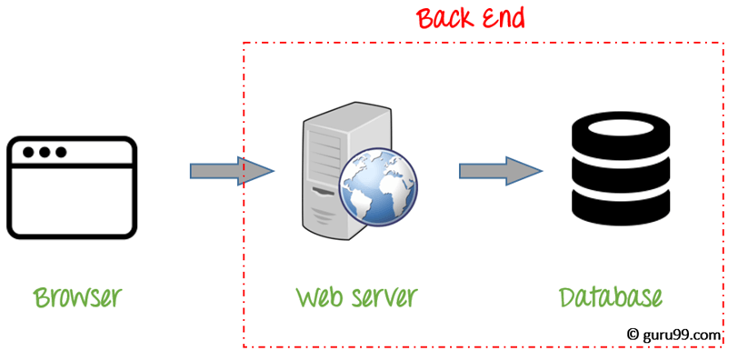

## Course Intro
At a very simple level, programming can be separated into three basic areas.
Databases, the BackEnd, and the FrontEnd.

#### The Three Areas

Databases store organised information, and can be imagined a bit like a table or
an excel spreadsheet. It runs on a server remote from the User's device.

The BackEnd handles this data, and the user's input. It also runs on a server remote
from the User's device.

The FrontEnd part of an app is what displays the information to the viewer, and
runs on the client (browser or mobile device).

Even if your have a preference for a certain area of coding, and intend to specialise
in one area exclusively, at this stage learning the foundation of each area still has
value. Seeing how they work together will give you an end to end understanding of
how websites and apps work, and will help you write code that coordinates better
with the rest of the website/app.

Here's a diagram explaining the typical flow between these areas. The client has the FrontEnd code, and the server holds the BackEnd code. "Data" in this case represents the Database, which exists on a server too.

#### Terminal
"An interface where you can type and execute text based commands."

Also, this course will aim to give you an understanding of the Terminal, and source
control(Git).

Developers use the terms Terminal, Command Line, Console and some others interchangeably.
Although there are subtle differences, they more or less refer to the same thing.
Normally you interact with visual icons to access Chrome, Word etc, and rely on
the nice high-definition screen to show you your instagrams and electronic mails,
and personal documents. The terminal is a basically a way of doing this with simple
text commands, and in a software development context, it's the environment where
we'll be running most of our code, so you need to learn it!

#### Git
Git is a type of Source/Version Control that we will learn as it makes it easier
to track changes you make to files. For example, when you edit a file, git can help you determine exactly what changed, who changed it, and why. It will also let you revert
your code to previous states too.

It’s useful for coordinating work among multiple people on a project, and for tracking
progress over time by saving “checkpoints”. You could also use it while writing
an essay, or to track changes to artwork and design files.

Git isn’t the only version control system out there, but it’s by far the most popular. Many
software developers use git daily, and understanding how to use it can give a major boost
to your resume.
